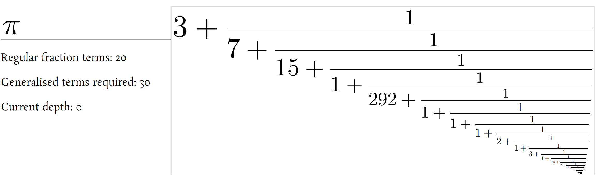

# matrix-numbers
Continued fractions using (almost) matrix representation and egestion.

This is the main class, and working example, of continued fraction computation. The purpose is to iteratively obtain the regular continued fraction given the explicit formulae of some generalized fraction. This is easily done with matrix representation of numbers, and Gosper's arithmetic, most notably his concept of egestion for dynamical numbers.

A very detailed article about the algorithm can be found [on my homepage](https://monodromy.group/zoomed/) - it also contains infinitely zoomable visualizations (and other mathematical constants).

Or you could just stare at [the video](https://youtu.be/wTshaUnBBVQ) for an hour...
